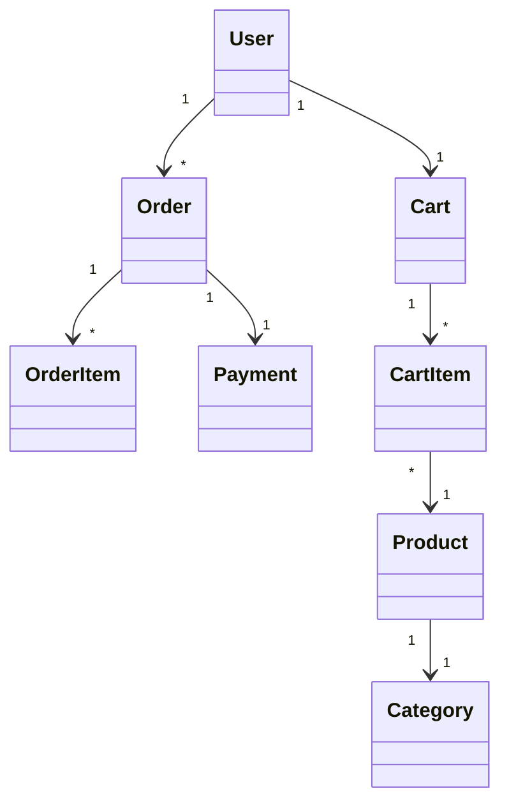
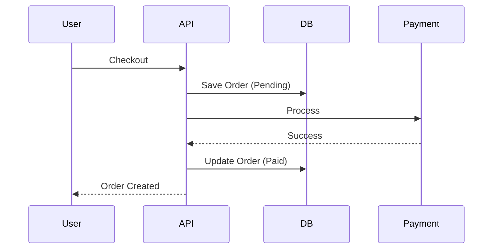

# UML Діаграми E-Commerce

## 1. Концептуальна модель даних (ER-діаграма)

Відображає, як пов'язані основні сутності.

```text
┌────────────┐ 1      * ┌──────────────┐
│    User    │──────────│    Order     │
│(Користувач)│          │ (Замовлення) │
└────────────┘          └──────────────┘
      │ 1                       │ 1
      │                         │
      │ 1                       │ 1
┌────────────┐          ┌──────────────┐
│    Cart    │          │   Payment    │
│  (Кошик)   │          │   (Оплата)   │
└────────────┘          └──────────────┘
      │ 1                       │ 1
      │                         │
      │ *                       │ 1
┌────────────┐ *      1 ┌──────────────┐
│  CartItem  │──────────│   Address    │
│  (Товар в  │          │  (Доставка)  │
│   кошику)  │          └──────────────┘
└────────────┘
      │ *
      │
      │ 1
┌────────────┐ 1      * ┌──────────────┐
│  Product   │──────────│  OrderItem   │
│  (Товар)   │          │  (Товар в    │
└────────────┘          │  замовленні) │
      │ *               └──────────────┘
      │
      │ 1
┌────────────┐
│  Category  │
│(Категорія) │
└────────────┘
```

## 2. Процес оформлення замовлення (Happy Path)

Покроковий шлях від "Натиснув купити" до "Отримав замовлення".

```text
User         Controller       OrderService      CartService    InventoryService   PaymentGateway     EventBus
 ☺               │                 │                 │                 │                 │               │
 │ POST /orders  │                 │                 │                 │                 │               │
 │──────────────>│                 │                 │                 │                 │               │
 │               │    getCart()    │                 │                 │                 │               │
 │               │──────────────────────────────────>│                 │                 │               │
 │               │                 │                 │                 │                 │               │
 │               │ return cart det │                 │                 │                 │               │
 │               │<─ ─ ─ ─ ─ ─ ─ ─ ─ ─ ─ ─ ─ ─ ─ ─ ─ │                 │                 │               │
 │               │                 │                 │                 │                 │               │
 │               │placeOrder(cart) │                 │                 │                 │               │
 │               │────────────────>│                 │                 │                 │               │
 │               │                 │    getCart()    │                 │                 │               │
 │               │                 │────────────────>│                 │                 │               │
 │               │                 │                 │                 │                 │               │
 │               │                 │   return cart   │                 │                 │               │
 │               │                 │<─ ─ ─ ─ ─ ─ ─ ─ │                 │                 │               │
 │               │                 │                 │                 │                 │               │
 │               │                 │ reserveStock(it)│                 │                 │               │
 │               │                 │──────────────────────────────────>│                 │               │
 │               │                 │                 │                 │                 │               │
 │               │                 │  stock reserved │                 │                 │               │
 │               │                 │<─ ─ ─ ─ ─ ─ ─ ─ ─ ─ ─ ─ ─ ─ ─ ─ ─ │                 │               │
 │               │                 │                 │                 │                 │               │
 │               │                 │ createOrder()   │                 │                 │               │
 │               │                 │───┐             │                 │                 │               │
 │               │                 │<──┘             │                 │                 │               │
 │               │                 │                 │                 │                 │               │
 │               │                 │dispatch(Placed) │                 │                 │               │
 │               │                 │────────────────────────────────────────────────────────────────────>│
 │               │                 │                 │                 │                 │               │
 │               │                 │processPayment() │                 │                 │               │
 │               │                 │────────────────────────────────────────────────────>│               │
 │               │                 │                 │                 │                 │               │
 │               │                 │payment processed│                 │                 │               │
 │               │                 │<─ ─ ─ ─ ─ ─ ─ ─ ─ ─ ─ ─ ─ ─ ─ ─ ─ ─ ─ ─ ─ ─ ─ ─ ─ ─ │               │
 │               │                 │                 │                 │                 │               │
 │               │                 │ dispatch(Paid)  │                 │                 │               │
 │               │                 │────────────────────────────────────────────────────────────────────>│
 │               │                 │                 │                 │                 │               │
 │               │  return orderId │                 │                 │                 │               │
 │               │<─ ─ ─ ─ ─ ─ ─ ─ │                 │                 │                 │               │
 │               │                 │                 │                 │                 │               │
 │ 200 OK (id)   │                 │                 │                 │                 │               │
 │<─ ─ ─ ─ ─ ─ ─ │                 │                 │                 │                 │               │
```

## 3. Життєвий цикл замовлення

Як змінюється статус замовлення.

```text
       [Створено]
           │
           ▼
    ┌─────────────┐
    │ ОЧІКУЄ      │     Помилка / Скасування
    │ ОПЛАТИ      │───────────────────────────┐
    └─────────────┘                           │
           │                                  │
           │ Успішна оплата                   │
           ▼                                  ▼
    ┌─────────────┐                    ┌─────────────┐
    │  ОПЛАЧЕНО   │                    │  СКАСОВАНО  │
    └─────────────┘                    └─────────────┘
           │
           │ Початок обробки
           ▼
    ┌─────────────┐
    │  В ОБРОБЦІ  │
    └─────────────┘
           │
           │ Передано кур'єру
           ▼
    ┌─────────────┐
    │ ВІДПРАВЛЕНО │
    └─────────────┘
           │
           │ Отримано клієнтом
           ▼
    ┌─────────────┐
    │ ДОСТАВЛЕНО  │
    └─────────────┘
```

## 4. Шарувата Архітектура (Layered Architecture)

Детальна структура шарів додатку, що показує потік даних зверху вниз.

```text
+---------------------------------------------------------------------------------------+
|                                  PRESENTATION LAYER                                   |
|                          (Шар представлення - Вхідні точки)                           |
+---------------------------------------------------------------------------------------+
       │                      │                              │
       ▼                      ▼                              ▼
+--------------+       +--------------+              +--------------+
|    Web UI    |       |   REST API   |              |  Admin Panel |
|    (Twig)    |       |  (Platform)  |              |              |
+------+-------+       +------+-------+              +------+-------+
       │                      │                             │
       │                      │                             │
       ▼                      ▼                             ▼
+---------------------------------------------------------------------------------------+
|                                   APPLICATION LAYER                                   |
|                     (Шар застосунку - Обробники команд/запитів)                       |
+---------------------------------------------------------------------------------------+
| +----------+ +--------+ +--------+ +---------+ +-----------+ +-----------+            |
| | Catalog  | |  User  | |  Cart  | |  Order  | |  Payment  | | Inventory |            |
| | Handlers | |Handlers| |Handlers| |Handlers | | Handlers  | | Handlers  |            |
| +----+-----+ +----+---+ +----+---+ +----+----+ +-----+-----+ +-----+-----+            |
+------|------------|----------|----------|------------|-------------|------------------+
       │            │          │          │            │             │
       ▼            ▼          ▼          ▼            ▼             ▼
+---------------------------------------------------------------------------------------+
|                                     DOMAIN LAYER                                      |
|                       (Шар домену - Бізнес-логіка та сутності)                        |
+---------------------------------------------------------------------------------------+
| +----------+ +--------+ +--------+ +---------+ +-----------+ +-----------+            |
| | Catalog  | |  User  | |  Cart  | |  Order  | |  Payment  | | Inventory |            |
| |  Domain  | | Domain | | Domain | | Domain  | |  Domain   | |  Domain   |            |
| +----+-----+ +----+---+ +----+---+ +----+----+ +-----+-----+ +-----+-----+            |
+------|------------|----------|----------|------------|-------------|------------------+
       │            │          │          │            │             │
       ▼            ▼          ▼          ▼            ▼             ▼
+---------------------------------------------------------------------------------------+
|                                 INFRASTRUCTURE LAYER                                  |
|                      (Інфраструктурний шар - Робота з даними)                         |
+---------------------------------------------------------------------------------------+
|  +--------------+  +-------+  +-------------+  +------------+  +----------+           |
|  |  PostgreSQL  |  | Redis |  |Elasticsearch|  |  RabbitMQ  |  | Payment  |           |
|  | Repositories |  | Cache |  |   Search    |  | Messenger  |  | Gateways |           |
|  +--------------+  +-------+  +-------------+  +------------+  +----------+           |
+---------------------------------------------------------------------------------------+
```

---

### ER Diagram


### Sequence Diagram

</details>
